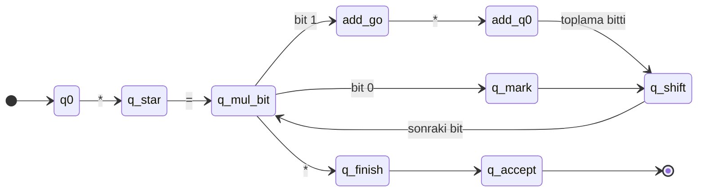

https://github.com/the-duru/turing-makinesi-binary-carpma/tree/main
# Tek Bantlı Turing Makinesi ile İkili Sayı Çarpma — Proje Raporu

## 1. Problem tanımı

İşlemciler aritmetiği binary sistemde yapar; çarpma çoğu zaman **kaydır ve topla (shift & add)** ile modellenir. Bu projede iki binary sayının çarpımı, tek bantlı bir **Turing Makinesi (TM)** simülatörü ile gerçekleştirilir.

Kullanıcıdan alınan sayılar bant formatına dönüştürülür; makine `*` ile operandları ayırır, shift & add ile sonucu `=` sonrasına yazar.

## 2. Binary sayı sistemi

| Binary | Decimal |
|--------|---------|
| 11 | 3 |
| 10 | 2 |
| 110 | 6 |

Çarpma: `11₂ × 10₂ = 3 × 2 = 6 = 110₂`

## 3. Turing Makinesi modeli

| Bileşen | Tanım |
|---------|--------|
| Q | {q0, q_star, q_mul_bit, add.*, q_shift, q_finish, q_accept, q_red, …} |
| Σ | {0, 1, *, =} |
| Γ | Σ ∪ {_, x} |
| q₀ | q0 |
| F | {q_accept} |
| δ | `GECIS_TABLOSU.md` + `turing_binary_carpma.py` |


## 4. Operand ayrıştırma (zorunlu)

Makine önce `*` karakterini **durum geçişleriyle** bulur:

1. **q0:** Soldan sağa 0/1 okuyarak `*` ara
2. **q_star:** `*` bulundu → sol taraf **çarpılan**, sağ taraf **çarpan**
3. **q_star** çarpan bitlerini okuyarak `=` konumuna gelir
4. **q_mul_bit:** `=` solundaki en sağ çarpan bitinden shift & add başlar

Bu ayrım yapılmadan çarpma geçerli sayılmaz; program `*` bulunduğunda bunu adım çıktısında açıkça belirtir.

## 5. Shift & add mantığı

Çarpanın bitleri **sağdan sola** işlenir (`x` ile işaretlendi):

| Bit (sağdan) | Değer | İşlem |
|--------------|-------|--------|
| 1. (LSB) | 0 | Toplama yok |
| 2. | 1 | `çarpılan << 1` sonuç alanına eklenir → 110 |

Örnek `11 × 10`:

```
  11
× 10
------
  00   ← LSB=0, işlem yok
+110   ← sonraki bit=1, 11 kaydırılmış
------
 110
```

## 6. Durumların açıklaması

| Durum | Görev |
|-------|--------|
| q0 | Bant başında, `*` ara |
| q_star | Operandlar ayrıldı, çarpana geç |
| q_mul_bit | Çarpan bitini oku |
| add_go / add.* | Bit=1 ise toplama alt makinesi |
| q_mark / q_shift | Bit işlendi, kaydırma sayacı artır |
| q_finish | Sonuç yazıldı, kabul |
| q_red | Hatalı format |

## 7. Durum geçiş diyagramı (özet)



## 8. Test örnekleri (5 adet)

| Çarpılan | Çarpan | Binary sonuç | Decimal |
|----------|--------|--------------|---------|
| 11 | 10 | 110 | 6 |
| 101 | 11 | 1111 | 15 |
| 10 | 10 | 100 | 4 |
| 1 | 1 | 1 | 1 |
| 1111 | 10 | 11110 | 30 |

Test: `python turing_binary_carpma.py` → `t`

## 9. Program kullanımı

```bash
cd Odev1
python turing_binary_carpma.py
```

Örnek giriş: `11` ve `10` → bant `11*10=` → sonuç `110` (decimal: 6).

**Ekran görüntüsü:** Adım adım bant, durum, okunan/yazılan sembol ve hareket çıktısını rapora ekleyin.

## 10. Sonuç ve değerlendirme

Proje, TM’nin veri ayırma (`*`, `=`) ve algoritmik işlem (shift & add) modellenebileceğini gösterir. Operand ayrıştırma saf durum geçişleriyle; çarpma çarpan bitlerinin sağdan sola taranması ve `add.*` alt makinesiyle bant üzerinde sonuç alanına yazma ile yapılır.

Plaka tanıyıcı ödevine (Ödev 2) paralel olarak aynı yapı kullanılmıştır: Python simülatör, geçiş tablosu, Mermaid diyagram, test paketi ve rapor.

## 11. Dosyalar

| Dosya | Açıklama |
|-------|----------|
| `turing_binary_carpma.py` | Simülatör |
| `GECIS_TABLOSU.md` | Geçiş tablosu |
| `RAPOR.md` | Bu rapor |
| `README.md` | Hızlı başlangıç |
